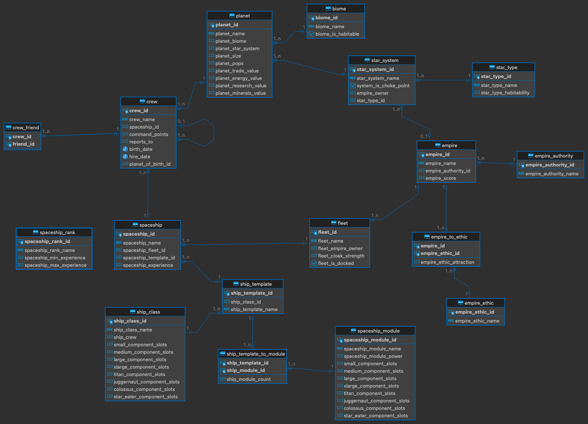

# Spaceships Database

A database of spaceships, loosely based
on [Stellaris](https://store.steampowered.com/app/281990/Stellaris/).

It should be compatible with any database that sqlalchemy supports.
However, only triggers for postgresql are provided.

